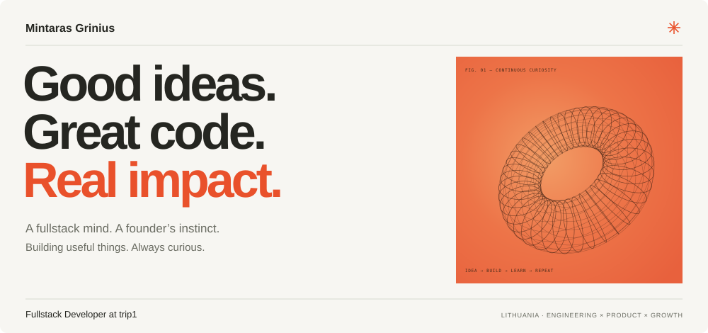
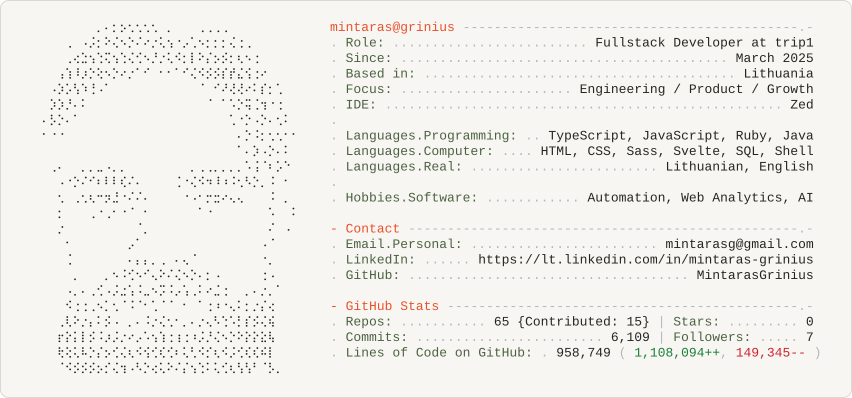

<picture>
  <source media="(max-width: 600px) and (prefers-color-scheme: dark)" srcset="./profile-dark-mobile.svg">
  <source media="(max-width: 600px) and (prefers-color-scheme: light)" srcset="./profile-light-mobile.svg">
  <source media="(prefers-color-scheme: dark)" srcset="./profile-dark.svg">
  
</picture>

 

[Email ↗](mailto:mintarasg@gmail.com) &nbsp; / &nbsp; [LinkedIn ↗](https://lt.linkedin.com/in/mintaras-grinius) &nbsp; / &nbsp; [What I’m building ↗](https://trip1.com)

### 01 / Currently building

I’m **Mintaras**, a fullstack developer and co-founder based in Lithuania. I care about the whole product: the interface, the systems behind it, and the details that make it useful.

At **[trip1](https://trip1.com)** since March 2025, working across hotel discovery, guest reviews, saved stays, and the mobile booking experience. Previously at **CoinGate**, from 2021 to March 2025.

### 02 / A few things I’ve put my mind into

| Project | What it’s about | My part |
| :--- | :--- | :--- |
| **[trip1 ↗](https://trip1.com)** | Making the next getaway feel closer. Hotel discovery and booking. | Fullstack developer |
| **[PaceTri ↗](https://www.pacetri.com/lt)** | AI-powered triathlon training. Where building meets endurance. | Co-founder |
| **[PreeWoo ↗](https://preewoo.com/)** | A platform built to surface what matters. | Co-founder |
| **[Cyber Servers ↗](https://github.com/MintarasGrinius/cyber-servers)** | A small, focused app for managing servers. | Personal project |

### 03 / Tools I think in

**Build** &nbsp; TypeScript · JavaScript · React · Next.js · Ruby on Rails · Svelte 
**Foundations** &nbsp; Java · SQL · HTML · CSS · Shell 
**Explore** &nbsp; Automation · Web analytics · AI · Product growth

### 04 / Beyond the keyboard

A builder’s mind. An athlete’s heart. Usually running, swimming, cycling, or skateboarding with my wife. Curiosity keeps me building; endurance keeps me going.

---

**Have something in mind? [Let’s build something good. ↗](mailto:mintarasg@gmail.com)**

  
Under the hood — GitHub activity &amp; the original ASCII portrait

   
  <picture>
    <source media="(prefers-color-scheme: dark)" srcset="./dark_mode.svg">
    
  </picture>
  
Updated daily. Repository and activity totals depend on the workflow token’s visibility. The legacy “Commits” total combines public commit contributions and restricted contributions; lines of code reflect authored additions and deletions on repository default branches.

